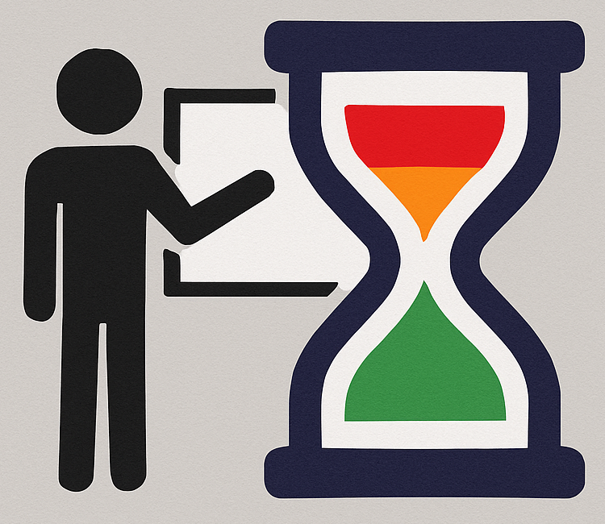
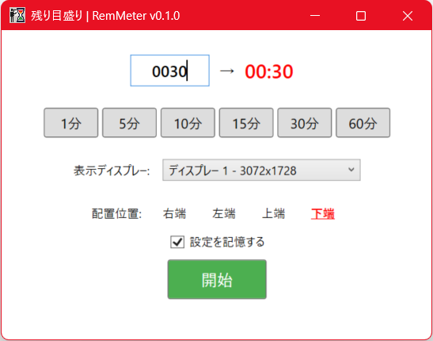
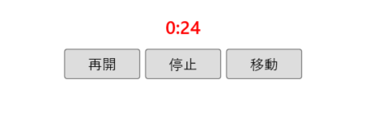
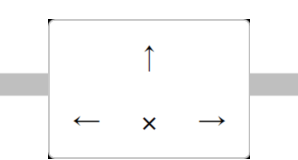
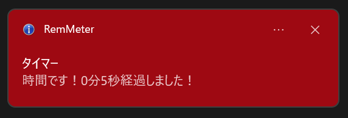
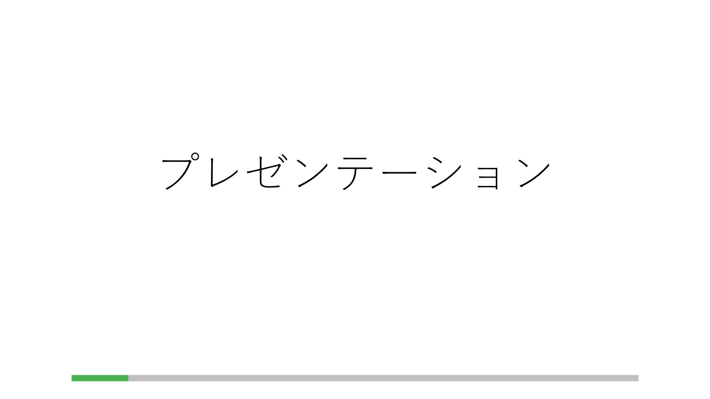

# 残り目盛り | RemMeter



プレゼンテーション等の際に、直感的に残り時間を把握できるお役立ちタイムキーパーです。

画面端に細長く表示されるため、プレゼンの資料投影中でも邪魔になりません。

単純なアプリケーションなので、操作説明書なしに使えます。

## 特色

- 砂時計や動画のシークバーをパクった視覚的なアナログ進捗表示
- 上下左右から選べる表示位置
- マルチディスプレー、DPI対応
- 一時停止
- タイムアップ通知
- 常に最前面に表示

## WPF版 (Windows専用)

### システム要件
- .NET 8.0 SDK以上
- Windows 10/11
- マルチディスプレー環境（オプション）

### ダウンロード

[Releases](https://github.com/yokenzan/rem-meter/releases)よりダウンロードできます。

#### Framework-dependent版（サイズ小）
- `RemMeter-framework-dependent-win-x64.exe` - 64bit Windows用
- `RemMeter-framework-dependent-win-x86.exe` - 32bit Windows用

> [!NOTE]
> [.NET 8.0 Desktop Runtime](https://dotnet.microsoft.com/download/dotnet/8.0)が必要です。未インストールの場合、アプリ実行時に自動でダウンロードページに案内されます。

#### Self-contained版（サイズ大 .NET 8.0 Desktop Runtime不要）
- `RemMeter-self-contained-win-x64.exe` - 64bit Windows用
- `RemMeter-self-contained-win-x86.exe` - 32bit Windows用

### ビルド・実行

```bash
cd wpf
dotnet build
```

```bash
cd wpf
dotnet run
```

```bash
cd wpf
# 64bit版(Framework-dependent)
dotnet publish -c Release -r win-x64 --self-contained false -p:PublishSingleFile=true
# 32bit版(Framework-dependent)
dotnet publish -c Release -r win-x86 --self-contained false -p:PublishSingleFile=true
# 64bit版(Self-contained)
dotnet publish -c Release -r win-x64 --self-contained true -p:PublishSingleFile=true
# 32bit版(Self-contained)
dotnet publish -c Release -r win-x86 --self-contained true -p:PublishSingleFile=true
```

## スクリーンショット

### 初期画面



### タイマーバー

| UI | 進捗率(経過時間) |
|-----|-----|
|  | 0～59% |
|  | 60～79% |
|  | 80～100% |
|  | 一時停止中 |

### ホバー時のコントロールパネル


拡大



### カウント中のバーの表示位置変更


拡大



### タイムアップ通知



### 画面全体における表示イメージ

下端(水平表示)

<kbd></kbd>

左端(垂直表示)

<kbd></kbd>

## ライセンス

MIT License